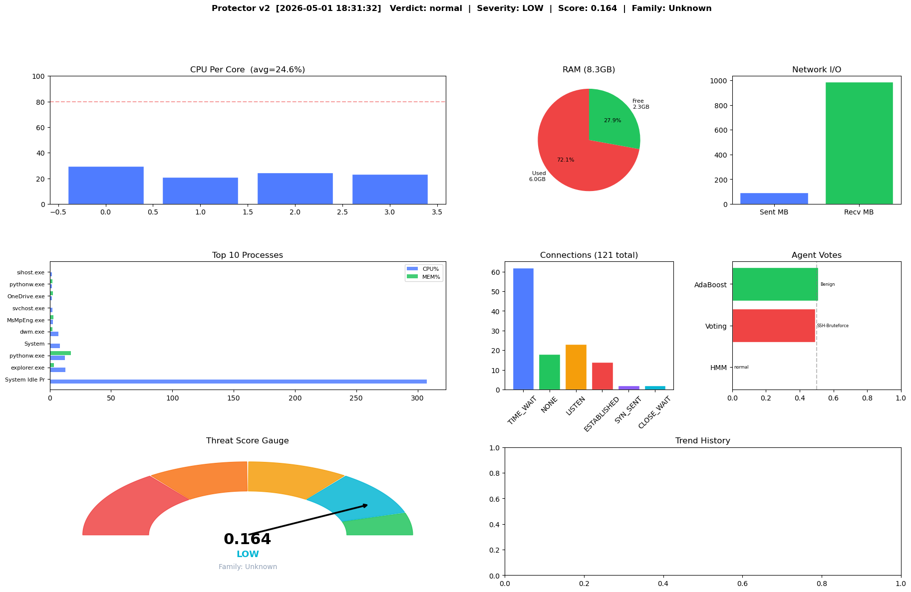
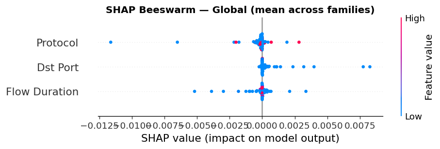
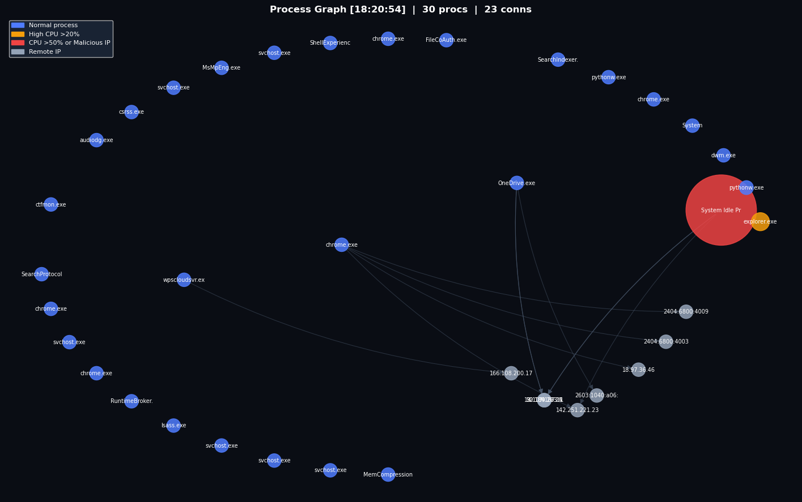

# Protector v2 - Multi-Agent AI Security System

[](https://python.org)
[](https://tensorflow.org)
[](LICENSE)

A production-grade real-time AI security system that runs 14 ML/DL agents
simultaneously on a local machine, detecting intrusions and malware
across 3 benchmark datasets with SHAP explainability.

## Architecture

| Notebook | Dataset | Models | Purpose |
|----------|---------|--------|---------|
| NB1 | CIC-IDS 2018 | SVM, RF, DT, NB, ELM, GBC, Ensemble | Classical ML intrusion detection |
| NB2 | UNSW-NB15 | CNN, LSTM, GRU, ResNet, GAN, Autoencoder | Deep learning sequence detection |
| NB3 | BETH | HMM, HDBSCAN, K-Means, Process2Vec | Clustering and sequence embeddings |
| NB4 | Live system | All 14 agents fused | Real-time endpoint with tray |
| NB5 | CIC-IDS 2018 | SHAP, GradCAM, FamilyCLF, Stacking | Explainability and family classification |

## Screenshots

### Dashboard


### SHAP Explainability


### GradCAM Attention


### Process Graph


## Results

| Model | Dataset | Accuracy |
|-------|---------|----------|
| Random Forest | CIC-IDS 2018 | ~97% |
| Gradient Boosting | CIC-IDS 2018 | ~96% |
| ResNet-1D | UNSW-NB15 | ~96% |
| LSTM | UNSW-NB15 | ~95% |
| Meta Ensemble (Stacking) | CIC-IDS 2018 | ~98% |

## Quick Start

```bash
git clone https://github.com/YOUR_USERNAME/protector-v2.git
cd protector-v2/nb4_endpoint
pip install -r requirements.txt
python tray.py
```

## Datasets

- [CIC-IDS 2018](https://www.unb.ca/cic/datasets/ids-2018.html) - 80 network flow features
- [UNSW-NB15](https://research.unsw.edu.au/projects/unsw-nb15-dataset) - 45 features, 9 attack types
- [BETH](https://www.kaggle.com/datasets/katehighnam/beth-dataset) - host process logs

## Tech Stack

Python - scikit-learn - TensorFlow - SHAP - NetworkX - hmmlearn
hdbscan - gensim - psutil - pystray - Groq API

## License

MIT
